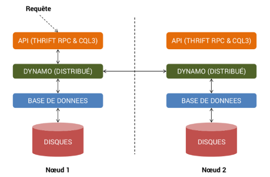
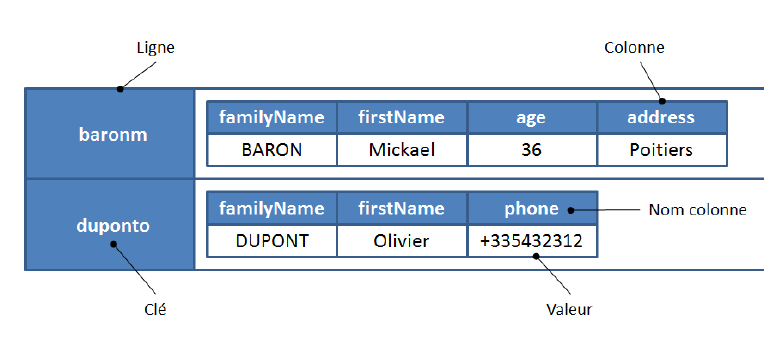
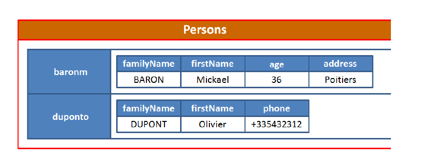
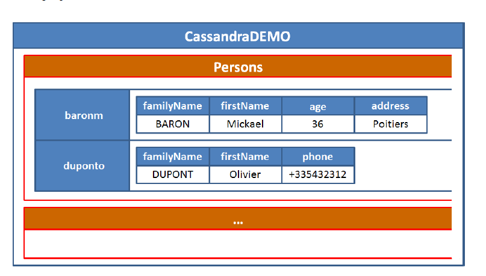
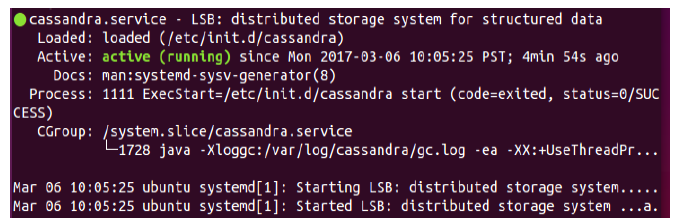

#                                            Apache Cassandra

## Autour et Audience
Ce tutoriel estt réalisé dans le cadre du UE GLG203. Avant d'entrer dans le vif du sujet, une petite présentation de la base de données Apache Cassandra s'impose pour ceux qui ne la connaissent pas.

## C'est quoi Cassandra?
Apache Cassandra est un système de gestion de base de données (SGBD) de type NoSQL conçu pour gérer des quantités massives de données sur un grand nombre de serveurs, assurant une haute disponibilité en éliminant les points individuels de défaillance. Il permet une répartition robuste sur plusieurs centres de données, avec une réplication asynchrone sans master et une faible latence pour les opérations de tous les clients. 
Aussi il est Orientée colonnes et Décentralisée.
Il est fondée initialement par Facebook, mais en 2008, Facebook transmet ce projet à la fondation Apache
### Les utilisateurs de Cassandra
* Twitter l'utilise pour les données statistiques et la géolocalisation.
* Digg a décidé de réimplémenter entièrement sa gestion de données sous Cassandra.
* Netflix, l'entreprise de streaming TV préfère renoncer aux avantages du relationnel pour l'extensibilité de Cassandra.
* Ebay.
* Instagram.
 
## Pourquoi Cassandra?
* Ne nécessite pas un système de fichiers distribué comme HBase.
* Permet de stocker une large quantité de données.
* Très rapide pour manipuler un volume important de données
* Permet la scalabilité horizontale.
* Assure la disponibilité et la tolérance aux pannes.
Un comparatif de performances fourni par Apache:

    Ecriture: MySQL: 300 ms. Cassandra: 0,12 ms.

    Lecture: MySQL: 350 ms. Cassandra: 15 ms.
    
    Différences de conception:

    Nombre de colonnes: MySQL: 4096. Cassandra: 2 milliards.

## Théorème CAP
Dans le monde des bases de données NoSQL, on entend souvent parler du Théorème CAP. Ce théorème établit 3 paramètres sur lesquels on peut jouer pour configurer une base de données distribuée :
*    La cohérence ( C pour Consistency)
*    La disponibilité ( A pour Availability)
*    La tolérance aux pannes et aux coupures réseaux ( P pour Partition-tolerance)

Le théorème postule que pour toute base de données distribuée, on ne peut choisir que 2 de ces 3 paramètres, jamais les 3 en même temps. En théorie, on peut donc choisir les couples suivants :

a. Cohérence et disponibilité ( CA ) donc non résistante aux pannes ( P )

b. Cohérence et tolérance aux pannes ( CP ) donc non disponible à 100% ( A )

c. Disponibilité et tolérance aux pannes ( AP ) donc non cohérente à 100% ( C )

Ceci est la théorie. En pratique, on se rend compte que le paramètre P est plus ou moins imposé. En effet, les coupures réseaux cela arrive, c'est inévitable, même si on s'appelle Google... Du coup, le choix se résume en fin de compte à CP ou AP. Cassandra fait clairement le choix de AP pour une tolérance aux pannes et une disponibilité absolue. En contrepartie, Cassandra sacrifie la cohérence absolue (au sens ACID du terme) contre une cohérence finale, c'est à dire une cohérence forte obtenue après une convergence des données.

## Architecture
L'architecture Cassandra s'inspire énormément du papier de recherche Big Table de Google, ainsi que de l'architecture Dynamo d'Amazon. Le moteur de stockage de Cassandra dérive directement de Big Table alors que sa couche de distribution de données s'inspire de l'architecture de Dynamo.

Sur le schéma ci-dessus, on distingue la présence de 3 couches métiers :
*    API, responsable de recevoir les requêtes venant des clients sous format Thrift (protocole RPC) ou dans le nouveau format binaire CQL3
*    Dynamo, responsable de la distribution des données entre différents noeuds et du protocole peer-to-peer
*    Base de données, responsable de la persistance des données sur disques
* Distribuée sur plusieurs serveurs appelés noeuds.
* Les noeuds sont égaux : pas de maître/esclave.
* communiquent ensemble pour la gestion des données.
* Le regroupement de noeuds est appelé un cluster.

## Distribution de Données
Dans un cluster, les partitions dans une table sont réparties entre plusieurs noeuds. Il y a 2 façons de répartir les données :

1) De manière ordonnée, chaque noeud prend en charge une plage de clé de partition triée par ordre croissant.

2) De manière aléatoire, chaque noeud prend en charge une plage de la clé de partition distribuée uniformément.

Clé de partition = K

Fonction de hachage (ex: MD5): F()

F(K) = token

MD5 --> [0- (2127 -1)]

token ϵ [0- (2127 -1)]

## Réplication
Tolérance aux pannes => Réplication des données sur les noeuds de cluster:
* le nombre réplication (= nombre de noeuds) => facteur de réplication (RF)
* RF =1 => une seule réplication, RF= 2 => 2 réplications

## Structure des données
* Colonnes
* Lignes
* Famille de colonnes
* Keyspace

### Colonne
* La plus petite unité de modèle
* constituée d’un nom, d’une valeur et d’un timestamp
* Le timestamp la valeur la plus récente
* Le nom peut atteindre 64 Koctets
* la valeur 2 Goctets

### Ligne
* Un ensemble de colonnes
* Peut contenir jusqu'à deux milliards de colonnes
* Possède une clé qui peut atteindre aussi 64 Koctets

### Famille de colonnes
* Un ensemble de lignes
* Correspond à peu près à une table dans une base de données ordinaire.

### Keyspace 
c'est l'équivalent d'une database dans le monde des bases de données relationnelles. À noter qu'il est possible d'avoir plusieurs « Keyspaces » sur un même serveur.

### Cqlsh Commands
* Cqlsh documented shell commands:
    * HELP - Displays help topics for all cqlsh commands.
    * CAPTURE - Captures the output of a command and adds it to a file.
    * CONSISTENCY - Shows the current consistency level, or sets a new consistency level.
    * COPY - Copies data to and from Cassandra.
    * DESCRIBE - Describes the current cluster of Cassandra and its objects.
    * EXPAND - Expands the output of a query vertically.
    * EXIT - Using this command, you can terminate cqlsh.
    * PAGING - Enables or disables query paging.
    * SHOW - Displays the details of current cqlsh session such as Cassandra version, host, or data type assumptions.
    * SOURCE - Executes a file that contains CQL statements.
    * TRACING - Enables or disables request tracing.
* CQL Data Definition Commands
    * CREATE KEYSPACE - Creates a KeySpace in Cassandra.
    * USE - Connects to a created KeySpace.
    * ALTER KEYSPACE - Changes the properties of a KeySpace.
    * DROP KEYSPACE - Removes a KeySpace
    * CREATE TABLE - Creates a table in a KeySpace.
    * ALTER TABLE - Modifies the column properties of a table.
    * DROP TABLE - Removes a table.
    * TRUNCATE - Removes all the data from a table.
    * CREATE INDEX - Defines a new index on a single column of a table.
    * DROP INDEX - Deletes a named index.
* CQL Data Manipulation Commands
    * INSERT - Adds columns for a row in a table.
    * UPDATE - Updates a column of a row.
    * DELETE - Deletes data from a table.
    * BATCH - Executes multiple DML statements at once.
* CQL Clauses
    * SELECT - This clause reads data from a table
    * WHERE - The where clause is used along with select to read a specific data.
    * ORDERBY - The orderby clause is used along with select to read a specific data in a specific order.

## Installation sur ubuntu 18.04
Etapes:
* Oracle Java SE Runtime Environment (JRE):
*  Rendre le JRE package disponible 
$ sudo add-apt-repository ppa:webupd8team/java 
*  Mise à jour par la commande suivante:
 $ sudo apt-get update 
*  Installer JRE avec cette commande:
 $ sudo apt-get install oracle-java8-set-default 
*  Une vérification pour savoir que tout est correcte:
 $ java –version 
*  Vous devez recevoir un message pareil :
 java version "1.8.0_60" Java(TM) SE Runtime Environment (build 1.8.0_60-b27) Java HotSpot(TM) 64-Bit Server VM (build 25.60-b23, mixed mode)
* Installer Cassandra sur Ubuntu 18.04

*  Import de la repertoire GPG par la commande "wget": 
   
       $ wget -q -O - https://www.apache.org/dist/cassandra/KEYS | sudo apt-key add -

*  Import de la repertoire Cassandra par "issuing": 
   
       $ sudo sh -c 'echo "deb http://www.apache.org/dist/cassandra/debian 311x main" > /etc/apt/sources.list.d/cassandra.list'

*     Mettre à jour package avant installation: $ sudo apt-get update 
*     Installer Cassandra $ sudo apt-get install Cassandra

Pour savoir le statut de Cassandra, si tout va bien et Cassandra est disponible on utilise cette commande:
 $ sudo service cassandra status
- Si Cassandra est disponible on verra le message suivant :

- Pour démarrer Cassandra on utilise cette commande : $ sudo service Cassandra start
- Pour l’arrêter : $ sudo service Cassandra stop 
- Pour manipuler les données et utiliser le langage CQL on exécute d’abord la commande suivante: $ cqlsh
- Un example pour tester cassandra cql: <a href="https://github.com/abdelmajidnadar/c1tutorial/blob/master/Example%20cassandra.txt" >Cliquez ici</a>